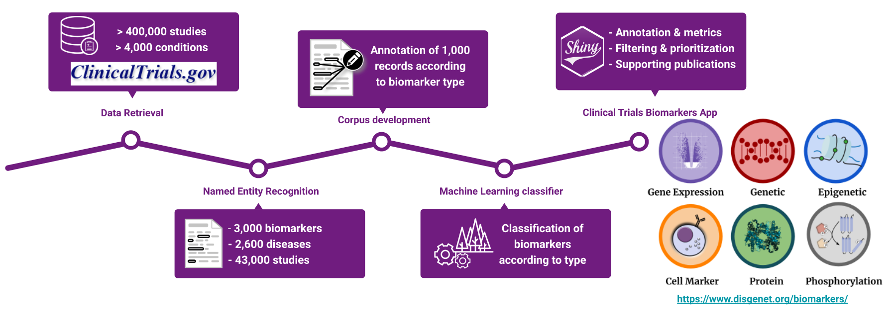

\vspace{12pt}
\setlength{\abovedisplayskip}{50pt}

&nbsp;
<br>  
<br>  
<br> <b>  Welcome to the Clinical Biomarkers App!   </b>
<br>  

```{r, echo=FALSE, out.width="100%",  fig.cap = ''}

```


Over 95% of protein-coding genes are associated with disease, however, only a dozen proteins are recognized as FDA qualified biomarkers. Clinical studies provide evidence to assess the value of a biomarker in the clinical setting. Nevertheless, the biomarkers in the studies are not standardized, posing challenges in finding, and integrating them with other sources of biomedical information. The Clinical Biomarkers App contains more than 3,000 biomarkers measured in 43,000 Clinical Trials involving 2,600 conditions. 

The Clinical Biomarkers app was developed by MedBioinformatics Solutions SL. 
The publication describing the app is currently under review: Genomic and proteomic biomarker landscape in Clinical Trials.
